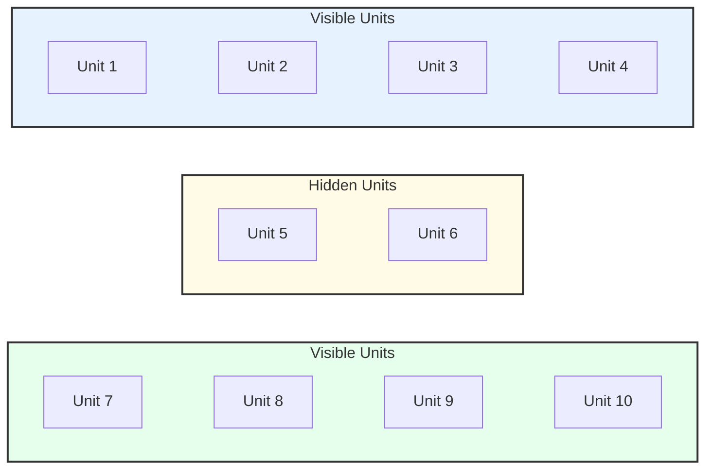

# Why the Exponential? From Max‑Entropy RL to the Boltzmann Distribution

Modern RL, attention mechanisms, classification, energy-based modeling, and statistical mechanics keep arriving at the same exponential shape:

$$
p(x)\;\propto\;\exp(\text{logits or reward}(x)/T)\quad\text{or}\quad p(x)\;\propto\;\exp(-E(x)/T).
$$

Why does the exponential keep showing up, and what does the "temperature" actually do?

<!-- more -->

To demonstrate some intuitions, this post will go through three views to explain why the exponential form is ubiquitous:

1) **Maximum Entropy Reinforcement Learning (MaxEnt RL)**: the optimal soft policy is an exponential of reward with an entropy-weighted objective;

2) **Energy-based Models (EBMs)**: probabilities are Boltzmann weights with a partition function $Z$;

3) **Statistical Mechanics**: Jaynes's maximum-entropy principle and ensemble theory (Boltzmann → Gibbs → Shannon → Jaynes) make the exponential inevitable under mean-value constraints.

## Table of Contents
[TOC]

## Maximum Entropy Reinforcement Learning

Last week I was reading the paper [All Roads Lead to Likelihood: The Value of Reinforcement Learning in Fine-Tuning](https://arxiv.org/abs/1812.05905)[@swamy2025roadsleadlikelihoodvalue]. In their proof to prove that DPO is equivalent to first train a reward model and then do on-policy RL to optimize the LLM with the help of the reward model, they used the conclusion from Maximum Entropy Reinforcement Learning (MaxEnt RL).

Since the MaxEnt RL framework underlies many modern reinforcement learning algorithms, I revisit its derivation here. During this process, I also found its close connection to statistical mechanics, which I will elaborate on below.

### Optimal-Soft Policy Form

In LLM post-training, when we have a reward function $r_{\theta}(\xi, s_0)$ to calculate the reward of a given trajectory $\xi$ generated by a LLM $\pi \in \Pi$ conditioned on the initial state $s_0$, i.e. $\xi \sim \pi(\cdot \mid s_0)$, we want to find the optimal-soft policy $\pi_{r_{\theta}, T}^\star$ that maximizes the expected reward while also not too complex so that it won't overfit the learned reward model, which itself acts as a synthetic data proxy.

Furthermore, we include an entropy regularization term, following Jaynes's maximum entropy principle, to encourage exploration and prevent degenerate deterministic policies.

**The Optimal-Soft Policy Form is defined as follows:**

$$
\begin{align}
  \pi _{r _{\theta}, T}^\star 
  &= \operatorname*{argmax} _{\pi\in\Pi} \;
  \mathbb{E} _{\xi\sim\pi} \! \left[r _{\theta}(\xi, s_0)\right] + T \cdot \mathcal{H}(\pi)\\
  \iff & \pi _{r _{\theta}, T}^\star(\xi \mid s_0)
  = \frac{\exp\!\big(r _{\theta}(\xi, s_0)/T\big)}{Z(r _{\theta},s_0,T)},\\
  & \text{where }Z(r _{\theta},s_0,T) = \sum _{\xi'\in \Xi}\exp\!\big(r _{\theta}(\xi', s_0)/T\big)
\end{align}
$$

Where:

- $\pi$ is a policy in $\Pi$, $\Pi$ is the set of all possible policies;
- Both $\xi$ and $\xi'$ are trajectories in $\Xi$, $\Xi$ is the set of all possible trajectories;
- $s_0$ is the initial state, $s_0 \sim \rho(s_0)$, it is corresponding to the prompt in LLM post-training;
- $T$ is a temperature parameter that controls the exploration-exploitation trade-off in Reinforcement Learning, or can be explained as a regularization strength that controls the importance of the entropy term in the objective function.

### Proof of Optimal-Soft Form

If we denote $\pi_i = \pi_{r_{\theta}}(\xi_i \mid s_0), \; r_i = r_{\theta}(\xi_i \mid s_0)$:

$$
\begin{aligned}
J(\pi,T) &=\mathbb{E} _{\xi\sim\pi} \! \left[r _{\theta}(\xi, s_0)\right] + T \cdot \mathcal{H}(\pi) \\
&= \sum_i \pi_i r_i -T \sum_i \pi_i \log \pi_i\\
\end{aligned}
$$

$$
J(\pi,T) = \underbrace{\sum_i \pi_i r_i}_{R(\pi)\text{: Expected Reward}} + T \cdot \underbrace{(- \sum_i \pi_i \log \pi_i)}_{H(\pi)\text{: Shannon Entropy}}
$$

In this formulation, the variables are $\{\pi_1,...,\pi_{\mid \Xi \mid}\}$, the constraint is $\displaystyle\sum_{i = 1}^{\mid \Xi \mid} \pi_i = 1$.

 

#### $J(\pi,T)$ is a Concave function
Given:
+ $R(\pi) = \displaystyle\sum_{i = 1}^{\mid \Xi \mid} \pi_i r_i$ is a linear function with respect to variables $\{p_1,...,p_{\mid \Xi \mid}\}$. And thus it is a concave function.
+ $H(\pi) = - \displaystyle\sum_{i = 1}^{\mid \Xi \mid} \pi_i \log \pi_i$ is a strictly concave function. When $T > 0$, $T \cdot H(\pi)$ is also strictly concave.

Thus when $T > 0$, the sum $J(\pi,T) = R(\pi) + T \cdot H(\pi)$ is strictly concave (since the sum of a concave and a strictly concave function is strictly concave).

Because $J(\pi,T)$ is strictly concave under the normalization constraint when $T > 0$, the stationary point found below is the unique global optimum.

 

#### Get The Optimal-Soft Policy Via Method of Lagrange Multipliers

Given $J(\pi,T)$ is a Concave function, we have the following Lagrange Function:

$$
\begin{align}
\mathcal{L}(\pi, T, \lambda) 
&= \underbrace{J(\pi,T)}_{\text{Original Target}} - \lambda \cdot \underbrace{(\sum_i \pi_i - 1)}_{\text{Constrain}} \\
&= \sum_i \pi_i r_i -T \sum_i \pi_i \log \pi_i - \lambda \left( \sum_{i = 1}^{\mid \Xi \mid} \pi_i - 1 \right)
\end{align}
$$

In order to find the maximum, we take the partial derivative with respect to any $\pi_i$ and set it to zero:
$$
\frac{\partial \mathcal{L}}{\partial \pi_i} = r_i - T (\log \pi_i + 1)  - \lambda = 0
$$
And we can get  $\pi_i$:

$$
\begin{align}
    \log \pi_i &= -1 -\lambda/T + r_i/T \\
    \pi_i &= \exp(-1 - \lambda/T) \cdot \exp(r_i/T)
\end{align}
$$

Thus:
$$
\pi_{r_{\theta}}^\star(\xi_i \mid s_0) \propto \exp\big(r_{\theta}(\xi_i \mid s_0) / T\big)
$$

And Because $\displaystyle\sum_{i = 1}^{\mid \Xi \mid} \pi_{r_{\theta}} = 1$, we can get the final form of Optimal-Soft Policy:

$$
\begin{align}
\pi _{r _{\theta}, T}^\star(\xi \mid s_0)
&= \frac{\exp\!\big(r _{\theta}(\xi, s_0)/T\big)}{Z(r _{\theta},s_0,T)}\\
\text{where }Z(r _{\theta},s_0,T) &= \sum _{\xi'\in \Xi}\exp\!\big(r _{\theta}(\xi', s_0)/T\big)
\end{align}
$$

## Energy-Based Models (EBM)

We have already known that the Optimal-Soft Policy is $\pi_{r_{\theta}, T}^\star(\xi \mid s_0) = \frac{\exp(r _{\theta}(\xi, s_0)/T)}{Z(r _{\theta},s_0,T)}$, and we can regard it as a special energy-based model. 

In the context of energy-based models, we call $E(\xi) = -r_{\theta}(\xi, s_0)$ the energy function, while $Z(r_{\theta}, s_0, T)$ serves as the partition function that normalizes the probabilities.

This identification reveals that the softmax over rewards in RL is mathematically identical to the Boltzmann distribution in physics, with reward playing the role of negative energy.

### The Very First Energy-Based Model

#### Hopfield Network

In 1982, J. Hopfield proposed the Hopfield Network [@hopfield1982neural], which first introduced the concept of energy function in neural networks. 

#### Boltzmann Machine

The first work that relatively introduced energy based model in Machine Learning should be the paper by Hinton and Sejnowski in 1985 [@hinton1985boltzmann].

##### Problem Setting:

- Given a set of binary vectors (data) $\{v^L\}$, where $v^L \in \{0,1\}^L$.
- In the dataset they used, there are 4 binary vectors with Length $8$: 

$$
\begin{align}
  \{&(1,0,0,0) -> (1,0,0,0), \\
    &(0,1,0,0) -> (0,1,0,0), \\
    &(0,0,1,0) -> (0,0,1,0), \\
    &(0,0,0,1) -> (0,0,0,1)\}  
\end{align}
$$

##### The Energy Function of Boltzmann Machine
The energy function of a Boltzmann machine is defined as follows:

$$
E = - \sum_{i < j} w_{ij} s_i s_j - \sum_i \theta_i s_i
$$

Where:

- $E$ is the energy of a global configuration of the network,
- $w_{ij}$ are the weights between units $i$ and $j$,
- $s_i$ is 1 if unit $i$ is on, and 0 if it is off,
- $\theta_i$ is a threshold for unit $i$.

As shown in the figure below, in their experiments setting, the Boltzmann machine has totally 10 units: the visible units 1-4 are corresponding to the first 4 digits, the visible units 7-10 are corresponding to the last 4 digits. The hidden units 5-6 are used to construct a information bottleneck and also disentangle the two part of data.

##### The Probability Distribution of Boltzmann Machine
The probability distribution over the states of the Boltzmann machine is given by the Boltzmann distribution:

$$
\frac{P_{\alpha}}{P_{\beta}} = e^{-(E_{\alpha} - E_{\beta})/T}
$$

Where:

- $P_{\alpha}$ is the probability of the network being in $\alpha^{th}$ state;
- $E_{\alpha}$ is the energy of the corresponding state.

Thus for arbitrary state $\alpha$, we can get the probability of the network being in this state:

$$
P_{\alpha} = \frac{e^{-E_{\alpha}/T}}{\displaystyle\sum_{\alpha^{\prime} \in \mathcal{A}} e^{-E_{\alpha^{\prime}}/T}} = \frac{e^{-E_{\alpha}/T}}{Z}
$$

Where:

- $\mathcal{A}$ is the set of all possible states of the network;
- $Z = \displaystyle\sum_{\alpha^{\prime} \in \mathcal{A}} e^{-E_{\alpha^{\prime}}/T}$ is the partition function, ensuring that the probabilities sum to 1.

##### Optimization of Boltzmann Machine

Optimization of Boltzmann machine is to minimize the Kullback-Leibler divergence between the data distribution and the model distribution, which is equivalent to maximizing the log-likelihood of the data under the model.

$$
G = \sum_{\alpha} P(V_{\alpha}) \log \frac{P(V_{\alpha})}{P^{\prime}(V_{\alpha})}
$$

Where:

- $P(V_{\alpha})$ is the data distribution;
- $P^{\prime}(V_{\alpha})$ is the model distribution defined by energy based model.

They optimize $G$ via stochastic gradient descent on the energy parameters, a precursor to the contrastive divergence training used in later works.

## Boltzmann Distribution and Gibbs Distribution

After the above sections, we can realize that the ubiquitous exponential form in probabilistic models originates from statistical mechanics:

- Generally speaking, the **Boltzmann distribution** refers specifically to the case under the **canonical ensemble** (NVT, i.e., constant particle number, volume, and temperature).

- The **Gibbs distribution/measure** is a more general concept that refers to any probability distribution of the form $p \propto e^{-\beta H}$ and can be applied to other physical ensembles.

The canonical definition of the Boltzmann distribution is as follows:

$$
\displaystyle P(x) = \frac{e^{-\beta E(x)}}{Z}
$$

where:

- $\displaystyle x$ represents a specific microstate of the system.
- $\displaystyle E(x)$ is the energy of the system in the microstate $x$.
- $\displaystyle \beta = \frac{1}{k_B T}$ is the **inverse temperature**. $k_B$ is the Boltzmann constant, and $T$ is the thermodynamic temperature.
- $\displaystyle Z = \sum_{x'} e^{-\beta E(x')}$ is the **partition function**, a normalization constant ensuring that the sum of probabilities over all states is 1.

### The Origin of Boltzmann and Gibbs Distribution

This beautiful exponential form does not arise out of thin air. 

Based on the **equal probability assumption of the microcanonical ensemble**, **weak coupling** between the system and the heat reservoir, and applying **Jaynes's maximum entropy principle** (or equivalent combinatorial counting methods) under the constraint of a given average energy, we can derive the Boltzmann distribution of the canonical ensemble. 

It is consistent with the macroscopic evolutionary direction described by the second law of thermodynamics, but more directly speaking, it is the **result of equilibrium statistics and maximum entropy inference**.

Let's break down the derivation process:

1. **Entropy defined by Boltzmann under Microcanonical Ensemble:** 

    For an isolated system with fixed energy, Boltzmann's hypothesis states that all accessible microstates are equally probable. The entropy is defined by the famous Boltzmann formula:

    $$
    S = k_B \ln W
    $$

    where $W$ is the total number of microstates.

     

2.  **Entropy defined by Gibbs under Canonical Ensemble:** 
    
    When the system is no longer isolated but is in contact with a large heat reservoir at constant temperature, the energy of the system will fluctuate. At this point, the probabilities of different energy microstates are no longer equal. 
    
    Gibbs generalized Boltzmann's entropy definition to the canonical ensemble, defining the entropy as:

    $$
    S = -k_B \sum_{x \in \mathcal{X}} p(x) \ln p(x)
    $$

    where:
    - $p(x)$ is the probability of the system being in microstate $x$. 
    - $\mathcal{X}$ is the set of all possible microstates of the system.
    
    What's worth noting is that this is exactly the **Shannon entropy** in information theory when $k_B$ is set to 1. This equivalence between physical and informational entropy later became the foundation of Jaynes's reinterpretation.

     

3.  **Calculate the explicit form of the distribution of whole system:**

    - **From the perspective of maximizing Gibbs Entropy:**

        In order to explicitly calculate the probability distribution $p(x)$, following Jaynes's principle of maximum entropy, we maximize the Gibbs entropy:

        $$
        S = -k_B \sum_{x \in \mathcal{X}} p(x) \ln p(x).
        $$

        Under the constraint of fixed average energy of the system, i.e $\displaystyle\mathbb{E}_{x \sim p(x)} [E(x)] = U$, and the normalization condition $\displaystyle\sum_x p(x) = 1$, we can formulate the constrained optimization problem as follows:

        $$
        \begin{align}
        \max_{p(x)} \quad & -k_B \sum_{x \in \mathcal{X}} p(x) \ln p(x) \\
        \text{subject to} \quad & \sum_{x \in \mathcal{X}} p(x) = 1, \\
        & \sum_{x \in \mathcal{X}} p(x) E(x) = U.
        \end{align}
        $$

        With the [method of lagrange multipliers](#get-the-optimal-soft-policy-via-method-of-lagrange-multipliers) mentioned before, the unique solution to this constrained optimization problem is the Boltzmann distribution:

        $$
        p(x) = \frac{e^{-\beta E(x)}}{Z} 
        $$

        where:

        - $\beta = \frac{1}{k_B T}$ is the inverse temperature, 
        - $Z = \displaystyle \sum_{x' \in \mathcal{X}} e^{-\beta E(x')}$ is the partition function.

    - **From the perspective of minimizing Helmholtz free energy:**

        The Helmholtz free energy $F$ (for canonical ensemble at constant $N$, $V$, $T$) is defined as:

        $$
        \begin{align}
        F &= U - TS \\
          &= \sum_{x \in \mathcal{X}} p(x) E(x) + k_B T \sum_{x \in \mathcal{X}} p(x) \ln p(x)
        \end{align}
        $$

        where:

        - $U$ is the internal energy, 
        - $T$ is the temperature,
        - $S$ is the entropy.

        We can see that:
        
        At equilibrium, minimizing the Helmholtz free energy $F$ with respect to the probability distribution $p(x)$ is equivalent to maximizing the entropy $S$ subject to the constraint of fixed average energy $\langle E \rangle = U$. Thus, both formulations—entropy maximization under energy constraint and free-energy minimization—lead to the same exponential family distribution.

     

This distribution relies on several key assumptions, including: weak coupling between the system and the heat reservoir, the thermodynamic limit (large number of degrees of freedom), and exhibiting ergodicity or typicality.

#### Gibbs Distribution: A More General Framework

The concept of the "Gibbs distribution" is more general and can unify the description of equilibrium distributions across different statistical ensembles. This is typically achieved by introducing an **effective Hamiltonian $H_{\text{eff}}$**, allowing the distribution to be uniformly expressed as $p \propto e^{-\beta H_{\text{eff}}}$.

All partition functions share the core form:
$$
\text{Partition Function} = \sum_{\text{states}} e^{-\beta (\text{Energy-like term})}
$$
where $\beta = 1 / (k_B T)$.

| Ensemble | Constraints | Random Variables | Effective Hamiltonian $H_{\text{eff}}$ | Partition Function | Thermodynamic Free Energy | Statistical Free Energy |
| :--- | :--- | :--- | :--- | :--- | :--- | :--- |
| **Microcanonical** | $N, V, E$ | (None) | **Not applicable**¹ | $\Omega(E,V,N)$ | $S=k_B\ln\Omega$ | (Fundamental definition) |
| **Canonical** | $N, V, T$ | Energy $E$ | $E$ | $Z = \sum_i e^{-\beta E_i}$ | $F = U - TS$ | $F = -k_B T \ln Z$ |
| **Grand Canonical** | $\mu, V, T$ | Energy $E$, Particle Number $N$ | $E-\mu N$ | $\Xi = \sum_{N,i} e^{-\beta(E_i - \mu N)}$ | $\Omega = U -TS -\mu N$ | $\Omega = -k_B T \ln \Xi$ |
| **Isothermal-Isobaric** | $N, P, T$ | Energy $E$, Volume $V$ | $E+PV$ | $\Delta = \int e^{-\beta(E + PV)} dV$ | $G = U - TS + PV$ | $G = -k_B T \ln \Delta$ |

**Key Relationships:**

- **From $Z$ to $\Xi$:** $\Xi = \sum_{N=0}^{\infty} e^{\beta \mu N} Z(N,V,T)$ (introduces particle number fluctuations)
- **From $Z$ to $\Delta$:** $\Delta = \int_0^{\infty} e^{-\beta PV} Z(N,V,T) dV$ (introduces volume fluctuations)

**Notes:**

[1] The microcanonical ensemble follows a uniform distribution $P(\text{state}) = 1/\Omega$ for accessible states with energy $E$, rather than the exponential Gibbs form $p \propto e^{-\beta H_{\text{eff}}}$. It serves as the foundation for other ensembles but doesn't itself belong to the Gibbs distribution family.

## Jaynes's Principle of Maximum Entropy

Jaynes (1957) recast statistical mechanics as **inference under incomplete information**: among all distributions consistent with the constraints you actually know, choose the one with **maximum Shannon entropy**. This yields the canonical Boltzmann/Gibbs form and, equivalently, a **free‑energy minimization** principle.

### History

- **1870s (Boltzmann):** Proposed the *statistical interpretation of entropy*, connecting microscopic configurations to macroscopic thermodynamic quantities through the celebrated formula:
  $$
  S = k_B \ln W
  $$
  where $S$ is entropy, $k_B$ is the Boltzmann constant, and $W$ is the number of accessible microstates. This marks the birth of statistical mechanics and introduces the probabilistic foundation of thermodynamics.

- **1902 (Gibbs):** Generalized Boltzmann's discrete-state formulation into a *probabilistic ensemble theory*. For systems in thermal equilibrium with varying probabilities $p_i$ for each microstate $i$, Gibbs defined:
  $$
  S = -k_B \sum_i p_i \ln p_i
  $$
  and derived the canonical and grand canonical ensembles, where the equilibrium distribution takes the now-fundamental exponential form:
  $$
  p_i = \frac{e^{-\beta E_i}}{Z}, \quad Z = \sum_i e^{-\beta E_i}.
  $$

- **1948 (Shannon):** Reinterpreted Gibbs's entropy in the context of communication theory as *information entropy*: [@shannon1948mathematical]
  $$
  H = -\sum_x p(x) \ln p(x),
  $$
  formally decoupling the mathematical structure of entropy from its physical meaning and laying the foundation of information theory.

- **1957 (Jaynes):** Unified Boltzmann–Gibbs statistical mechanics with Shannon's information theory in *"Information Theory and Statistical Mechanics I/II"* [@jaynes1957information].  
  Jaynes postulated that thermodynamic equilibrium corresponds to the **maximum entropy distribution** consistent with known constraints:
  $$
  \max_{p(x)} \; -\sum_x p(x)\ln p(x)
  $$
  subject to $\sum_x p(x)=1$ and $\sum_x p(x)E(x)=U$.  
  Solving this yields the **canonical Boltzmann distribution**:
  $$
  p(x)=\frac{e^{-\beta E(x)}}{Z}.
  $$
  This reframes statistical mechanics as *inference under incomplete information*, where maximizing entropy is equivalent to minimizing free energy.

## Conclusion

Although this note cannot cover every softmax function in machine learning, it provides intuition by illustrating the cases above, demonstrating why the exponential form appears ubiquitously across reinforcement learning, energy-based models, and statistical mechanics.

Whenever we introduce Shannon or Gibbs entropy as a regularization or principled constraint, the Gibbs distribution naturally emerges as the optimal solution—making the exponential form not just mathematically convenient, but fundamentally inevitable.

\bibliography{references}
